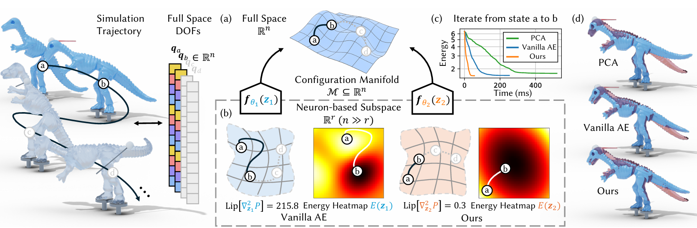

## Accelerate Neural Subspace-Based Reduced-Order Solver of Deformable Simulation by Lipschitz Optimization (SIGGRAPH ASIA 2024)
 
**Authors:** Aoran Lyu, Shixian Zhao, Chuhua Xian, Zhihao Cen, Hongmin Cai, Guoxin Fang



[[project page]](https://lip-neural-subspace.github.io)  [[PDF]](https://arxiv.org/pdf/2409.03807)

This repo contains an implementation of our core procedure and two trained models (including training data).

The code skeleton is adapted from the work of [[Sharp et al.]](https://github.com/nmwsharp/neural-physics-subspaces). We gratefully acknowledge their inspiring work.

## Installation Instructions

This repository is standard Python code tested with Python 3.9 on Ubuntu 20.04.

The most significant depenency is JAX, which can be installed according to instructions here: https://jax.readthedocs.io/en/latest/

Other dependencies are all available through pip and conda. Conda `environment.yml` file is included to help resolve dependencies.

## Usage Instructions

The process of our procedure includes:
- generating training data
- generating PCA basis and cubature weights
- training models
- running simulation

The following trained models are included:
- dinosaur
- bunny

You can run with the trained models or retrain a model with new parameters.

### Training a Model

To train a reduced model, call

```
python src/main_learn_AE_sup.py --config_json [config_json_file]
```
Example:

```
python src/main_learn_AE_sup.py --config_json dinosaur_models/config.json
```
Training parameters can be changed by editing `config_json`.
The key parameter `weight_landscape_reg` is the weight of lipschitz loss, if you want to train a model without lipschitz optimization, set it to zero.

### Running a Model

To run a simulation, call the following function:

```
python src/main_run_simulation_with_interactions.py --system_name [system_name] --problem_name [problem_name] --interaction_json [interaction_json_file] --pca_basis [pca_basis] --latent_encoder [latent_encoder_file_prefix]
```
Example:
```
python src/main_run_simulation_with_interactions.py --system_name fem --problem_name dinosaur --interaction_json dinosaur_models/test_interactions --pca_basis dinosaur_models/PCA_basis/basis --latent_encoder dinosaur_models/ae_ls/neural_subspaceAE_fem_dinosaur_dim40_landscapeA0.001_encoder_final
```

### Training Data Acquisition

We generate training data from full space simulation with random interactions.
- To get interaction sequences, use this script
```
python src/main_gen_interaction_json.py --system_name [system_name] --problem_name [problem_name] --n_sample [n_sample] --n_actuation_frames[n_actuation_frames] --n_empty_frames [n_empty_frames] --n_end_frames [n_end_frames]
--output_dir [output_dir]
```
Parameters instructions:
<br>
`n_samples`: number of interactions
<br>
`n_actuation_frames`: frames per interaction duration
<br>
`n_empty_frames`: number of frames between two interactions
<br>
`n_end_frames`: empty frames after last interaction
<br>
- To generate training data, use this script
```
python src/main_save_trajectory.py --system_name [system_name] --problem_name [problem_name] --output_dir [output_dir] --interaction_json [interaction_json_file]
```
This will run the simulation in the full space. Click on UI elements in the upper-right to run the dynamics, which will dump the simulation results for network training to `output_dir`.

### Generating PCA Basis and Cubature weights

- To generate PCA basis, use this script
```
python src/main_gen_PCA_basis.py --system_name [system_name] --problem_name [problem_name] --output_dir [output_dir] --data_dir [data_dir] --max_tol_error [max_tol_error] --max_n_basis [max_n_basis]
```
Parameters instructions:
<br>
`max_tol_error`: tolerance of maximal vertex error
<br>
`max_n_basis`: maximal number of PCA basis
<br>
- To cut down the memory cost and accelerate the training, we leverage the cubature method to approximate the second derivative.
```
python src/main_nnhtp_cubature.py --system_name [system_name] --problem_name [problem_name] --output_dir [output_dir] --data_dir [data_dir] --pca_basis [pca_basis_dir] --n_X [n_cubatures]
```
Where `n_X` is the number of cubatures.
